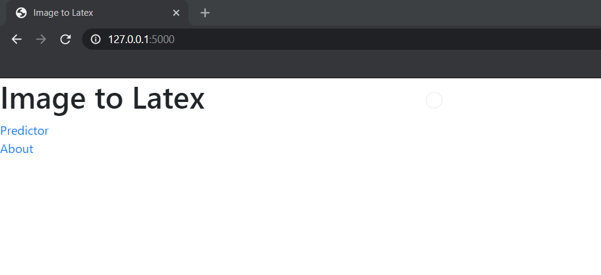
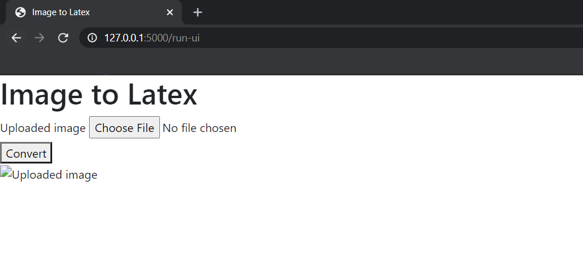

# Latex-Math

Project for CSCI 470/575. Aim is to take a picture of a handwritten equation and return it in latex format.

## Instillation

Pull the latest version of the repository onto your computer:

```
git clone https://github.com/34-Matt/Latex-Math.git
```

Additionally, a python environment needs to be setup. After creating your python environment using your favorite python package manager, go into the newly clone repository and run:

```
pip install -r requirement.txt
```

## Execution

The main executable in this repository is:

```
python FlaskWebpage.py
```

Once executated, it will create a webpage to run the actual program. The default setting should set it at *http://127.0.0.1:5000*. On the same computer your ran the script, open your default internet browser and go to the running website. 



Click on the *Predictor* link will send you to the selection page.



From here, you would search for the equation you wish to represent in Latex and then click *Convert* to return the equation.

Currently, this only works for images that are 90 pixels in height. Additionally, it will only work on simple quadratic equation with a low success rate. For better results, a new neural network with more training samples are needed. As the project stands, there is no intent to further improve the model. However, the model and training code is available for modification under the MIT licence agreement.
